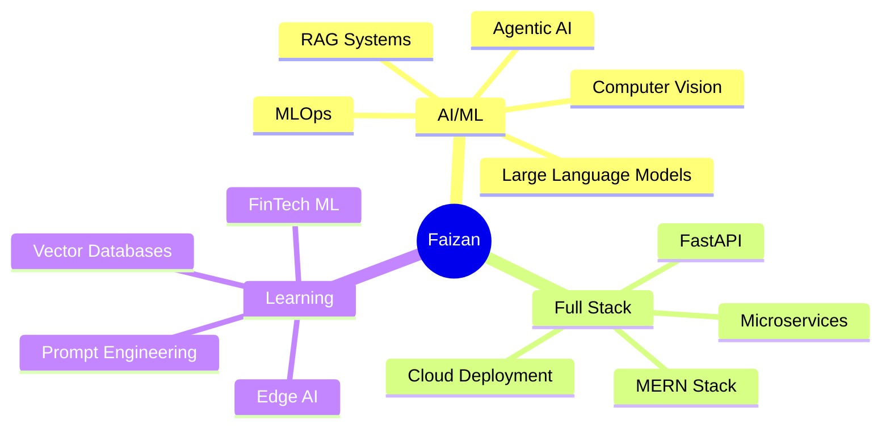

<h1 align="center">
  
</h1>

<p align="center">
  
</p>

<p align="center">
  
  
  
</p>

<p align="center">
  
</p>

---

## 🧠 About Me


```python
class DataScientist:
    def __init__(self):
        self.name = "Faizan Hamid Lone"
        self.role = "Full Stack Developer & AI Engineer"
        self.education = "M.Sc. Data Science @ Philipps-Universität Marburg"
        self.languages = ["Python", "JavaScript", "SQL"]
        self.specialties = ["LLMs", "RAG", "Computer Vision", "MLOps"]
    
    def get_current_work(self):
        return [
            "🔭 Building LLM & RAG applications with LangChain",
            "🤖 Real-Time AI systems (YOLO, DeepSort)",
            "🌐 Full-stack MERN applications",
            "📊 MLOps pipelines with MLflow & Docker"
        ]
    
    def say_hi(self):
        print("Thanks for dropping by! Let's build something amazing 🚀")

me = DataScientist()
me.say_hi()
```

<br clear="right"/>

- 🎓 **M.Sc. Data Science** at Philipps-Universität Marburg
- 🤖 Specializing in **Large Language Models**, **RAG Systems**, and **Agentic AI**
- 💻 Building **LLM applications** with LangChain, Vector Databases, and GenAI tools
- 🔥 Working on **Real-Time Computer Vision** (YOLOv8/10, DeepSort)
- 🌐 Full-stack developer with **MERN Stack**, FastAPI, and cloud deployment
- 🧠 Passionate about **NLP**, **MLOps**, **Explainable AI**, and **Financial Modeling**
- 📫 Reach me: **[LinkedIn](https://www.linkedin.com/in/faizan-hamid-50b113215)**
- ⚡ Fun fact: **Code is poetry, bugs are the typos!**


---

## 🌐 Connect With Me

<p align="center">
  <a href="https://www.linkedin.com/in/faizan-hamid-50b113215">
    
  </a>
  <a href="https://github.com/saffronhamid">
    
  </a>
  <a href="mailto:your-email@example.com">
    
  </a>
</p>

<p align="center">
  
</p>

---

## 🛠️ Tech Stack

<p align="center">
  
  
  
  
  
  
  
  
</p>

### 💻 Languages & Core Technologies

<p align="center">
  
</p>

### 🤖 AI/ML & Large Language Models

<p align="center">
  
  
  
  
  
</p>

<p align="center">
  
  
  
  
  
</p>

### 🗄️ Vector Databases & RAG Tools

<p align="center">
  
  
  
  
</p>

### 🎨 Frontend Development

<p align="center">
  
</p>

### ⚙️ Backend & Databases

<p align="center">
  
</p>

### 🔧 Tools & DevOps

<p align="center">
  
</p>


---

## 📊 GitHub Statistics

<p align="center">
  
</p>

<p align="center">
  
  
</p>

<p align="center">
  
</p>

### 🏆 GitHub Trophies

<p align="center">
  
</p>

### 📈 Contribution Graph

<p align="center">
  
</p>

### 🐍 Contribution Snake

<picture>
  <source media="(prefers-color-scheme: dark)" srcset="https://raw.githubusercontent.com/saffronhamid/saffronhamid/output/github-contribution-grid-snake-dark.svg">
  <source media="(prefers-color-scheme: light)" srcset="https://raw.githubusercontent.com/saffronhamid/saffronhamid/output/github-contribution-grid-snake.svg">
  
</picture>


---

## 💼 Featured Projects

<table>
  <tr>
    <td width="50%">
      <h3 align="center">🏠 SmartRent Platform</h3>
      <p align="center">
        <a href="https://github.com/saffronhamid/smartrent">
          
        </a>
      </p>
      <p align="center">
        
        
        
      </p>
      <p align="center">Full-stack MERN rental management platform with real-time features</p>
    </td>
    <td width="50%">
      <h3 align="center">🤖 LLM RAG System</h3>
      <p align="center">
        <a href="https://github.com/saffronhamid/llm-rag-system">
          
        </a>
      </p>
      <p align="center">
        
        
        
      </p>
      <p align="center">Retrieval-Augmented Generation system with vector databases</p>
    </td>
  </tr>
  <tr>
    <td width="50%">
      <h3 align="center">📊 NLP Summarization</h3>
      <p align="center">
        <a href="https://github.com/saffronhamid/nlp-summarization">
          
        </a>
      </p>
      <p align="center">
        
        
        
      </p>
      <p align="center">Abstractive text summarization with transformer models</p>
    </td>
    <td width="50%">
      <h3 align="center">🔐 Phishing Detector</h3>
      <p align="center">
        <a href="https://github.com/saffronhamid/phishing-detector">
          
        </a>
      </p>
      <p align="center">
        
        
        
      </p>
      <p align="center">ML-powered phishing detection with MLOps pipeline</p>
    </td>
  </tr>
  <tr>
    <td width="50%">
      <h3 align="center">👁️ Computer Vision</h3>
      <p align="center">
        <a href="https://github.com/saffronhamid/cv-projects">
          
        </a>
      </p>
      <p align="center">
        
        
        
      </p>
      <p align="center">Real-time object detection & tracking systems</p>
    </td>
    <td width="50%">
      <h3 align="center">🧠 Agentic AI</h3>
      <p align="center">
        <a href="https://github.com/saffronhamid/agentic-ai">
          
        </a>
      </p>
      <p align="center">
        
        
        
      </p>
      <p align="center">AI agents with tool calling and autonomous workflows</p>
    </td>
  </tr>
</table>


---

## 💡 What I'm Working On


---

## 💬 Random Dev Quote

<p align="center">
  
</p>

---

## 📫 Let's Build Something Amazing!

<p align="center">
  
</p>

<p align="center">
  
</p>

<p align="center">
  
</p>
