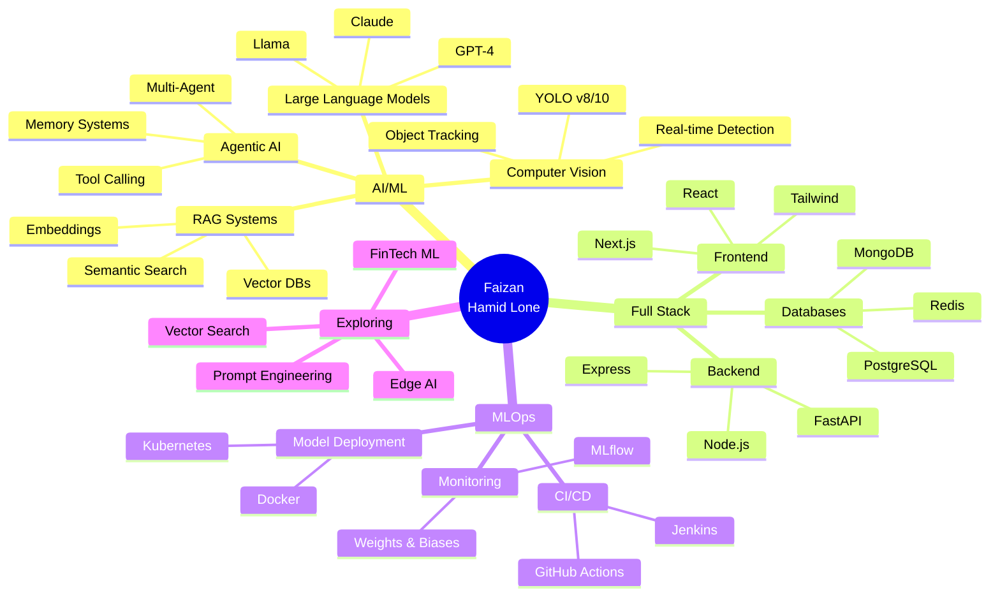

<h1 align="center">
  
</h1>

<p align="center">
  
</p>

<p align="center">
  
  
  
</p>

<p align="center">
  
</p>

---

## 🧠 About Me


```python
class AIEngineer:
    def __init__(self):
        self.name = "Faizan Hamid Lone"
        self.role = "Full Stack Developer & AI Engineer"
        self.education = "M.Sc. Data Science @ Philipps-Universität Marburg"
        self.languages = ["Python", "JavaScript", "SQL", "C++"]
        self.specialties = [
            "LLMs & RAG Systems",
            "Computer Vision",
            "MLOps & Deployment",
            "Full Stack Development"
        ]
    
    def current_focus(self):
        return {
            "🤖 GenAI": "Building LLM apps with LangChain & RAG",
            "👁️ Computer Vision": "Real-time detection with YOLOv8/10",
            "🌐 Full Stack": "MERN Stack & FastAPI applications",
            "📦 MLOps": "CI/CD pipelines with MLflow & Docker",
            "🚀 Cloud": "AWS & serverless deployments"
        }
    
    def say_hi(self):
        print("Thanks for visiting! Let's build the future with AI 🚀")

me = AIEngineer()
me.say_hi()
```

<br clear="right"/>

- 🎓 **M.Sc. Data Science** at Philipps-Universität Marburg
- 🤖 Specializing in **Large Language Models**, **RAG Systems**, and **Agentic AI**
- 💻 Building **GenAI applications** with LangChain, LlamaIndex, and Vector Databases
- 🔥 Expert in **Real-Time Computer Vision** (YOLOv8/10, DeepSort, Object Tracking)
- 🌐 Full-stack developer: **MERN Stack**, **FastAPI**, **REST APIs**
- 🛠️ **MLOps** enthusiast: MLflow, Docker, CI/CD, Model Deployment
- 🧠 Passionate about **NLP**, **Explainable AI**, and **Financial Modeling**
- 📫 Reach me: **[LinkedIn](https://www.linkedin.com/in/faizan-hamid-50b113215)**
- ⚡ Fun fact: **I turn coffee into code and AI models ☕→🤖**


---

## 🌐 Connect With Me

<p align="center">
  <a href="https://www.linkedin.com/in/faizan-hamid-50b113215" target="_blank">
    
  </a>
  <a href="https://github.com/saffronhamid" target="_blank">
    
  </a>
  <a href="mailto:your-email@example.com">
    
  </a>
  <a href="https://twitter.com/your-twitter" target="_blank">
    
  </a>
</p>

<p align="center">
  
</p>

---

## 🛠️ Tech Stack

<p align="center">
  
  
  
  
  
  
  
  
</p>

### 💻 Languages

<p align="center">
  
</p>

### 🤖 AI/ML & Large Language Models

<p align="center">
  
</p>

<p align="center">
  
  
  
  
  
</p>

<p align="center">
  
  
  
  
  
  
</p>

### 🗄️ Vector Databases & RAG Stack

<p align="center">
  
  
  
  
  
  
</p>

### 🎨 Frontend Development

<p align="center">
  
</p>

### ⚙️ Backend & APIs

<p align="center">
  
</p>

### 🗃️ Databases

<p align="center">
  
</p>

### 🔧 DevOps & Cloud

<p align="center">
  
</p>

### 🛠️ Tools & IDEs

<p align="center">
  
</p>


---

## 📊 GitHub Statistics

<p align="center">
  
</p>

<p align="center">
  
  
</p>

<p align="center">
  
</p>

### 🏆 GitHub Trophies

<p align="center">
  
</p>

### 📈 Contribution Graph

<p align="center">
  
</p>

### 🐍 Contribution Snake

<picture>
  <source media="(prefers-color-scheme: dark)" srcset="https://raw.githubusercontent.com/saffronhamid/saffronhamid/output/github-contribution-grid-snake-dark.svg">
  <source media="(prefers-color-scheme: light)" srcset="https://raw.githubusercontent.com/saffronhamid/saffronhamid/output/github-contribution-grid-snake.svg">
  
</picture>


---

## 💼 Featured Projects

<table>
  <tr>
    <td width="50%">
      <h3 align="center">🤖 LLM RAG System</h3>
      <p align="center">
        <a href="https://github.com/saffronhamid/llm-rag-system" target="_blank">
          
        </a>
      </p>
      <p align="center">
        
        
        
      </p>
      <p align="center">Advanced Retrieval-Augmented Generation system with vector databases and LangChain for intelligent document Q&A</p>
    </td>
    <td width="50%">
      <h3 align="center">🏠 SmartRent Platform</h3>
      <p align="center">
        <a href="https://github.com/saffronhamid/smartrent" target="_blank">
          
        </a>
      </p>
      <p align="center">
        
        
        
      </p>
      <p align="center">Full-stack MERN rental management platform with real-time features and payment integration</p>
    </td>
  </tr>
  <tr>
    <td width="50%">
      <h3 align="center">👁️ Computer Vision Suite</h3>
      <p align="center">
        <a href="https://github.com/saffronhamid/cv-projects" target="_blank">
          
        </a>
      </p>
      <p align="center">
        
        
        
      </p>
      <p align="center">Real-time object detection, tracking, and recognition using YOLOv8/10 and DeepSort algorithms</p>
    </td>
    <td width="50%">
      <h3 align="center">📊 NLP Summarization</h3>
      <p align="center">
        <a href="https://github.com/saffronhamid/nlp-summarization" target="_blank">
          
        </a>
      </p>
      <p align="center">
        
        
        
      </p>
      <p align="center">Abstractive text summarization pipeline using transformer models and attention mechanisms</p>
    </td>
  </tr>
  <tr>
    <td width="50%">
      <h3 align="center">🔐 Phishing Detector</h3>
      <p align="center">
        <a href="https://github.com/saffronhamid/phishing-detector" target="_blank">
          
        </a>
      </p>
      <p align="center">
        
        
        
      </p>
      <p align="center">ML-powered phishing detection system with complete MLOps pipeline and REST API</p>
    </td>
    <td width="50%">
      <h3 align="center">🧠 Agentic AI System</h3>
      <p align="center">
        <a href="https://github.com/saffronhamid/agentic-ai" target="_blank">
          
        </a>
      </p>
      <p align="center">
        
        
        
      </p>
      <p align="center">Autonomous AI agents with tool calling, memory, and multi-step reasoning capabilities</p>
    </td>
  </tr>
</table>


---

## 💡 Current Focus & Learning


---

## 📚 Latest Blog Posts

<!-- BLOG-POST-LIST:START -->
- 🤖 [Building Production-Ready RAG Systems with LangChain](#)
- 👁️ [Real-Time Object Detection: YOLOv8 vs YOLOv10](#)
- 🚀 [MLOps Best Practices: From Development to Production](#)
- 🧠 [Understanding Agentic AI: The Future of Autonomous Systems](#)
<!-- BLOG-POST-LIST:END -->

---

## 💬 Random Dev Quote

<p align="center">
  
</p>

---

## 🎯 2026 Goals

- 🎯 Contribute to 5+ open-source AI projects
- 📚 Publish research paper on LLM optimization
- 🚀 Launch 3 production-ready AI applications
- 🎓 Complete MLOps specialization
- 🤝 Collaborate with AI research community
- 💡 Build innovative RAG solutions for real-world problems

---

## 📫 Let's Build Something Amazing Together!

<p align="center">
  
</p>

<p align="center">
  
</p>

<p align="center">
  
</p>

<div align="center">

### Show some ❤️ by starring some of my repositories!

</div>
